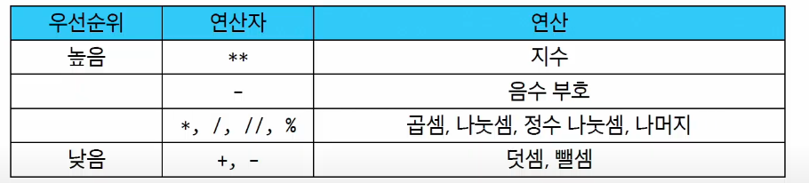

# 1일차

다중 선택: 싸피

## 프로그램이란

프로그램 : 문제를 해결하기 위한 명령어들의 집합

python ↔ python 인터프리터 ↔ 운영체제

### 파이썬 인터프리터 키기

인터프리터 vs 컴파일러

컴파일러 : 전체 코드를 번역한 후 한 줄씩 실행, 상대적으로 빠르다

인터프리터 : 코드를 한 줄씩 번역하며 실행, 디버깅이 편하다

```bash
python -i
```

## 표현식과 값

표현식(Expression) : 하나의  값으로 평가될 수 있는 모든 코드

```bash
3 + 5
x > 10
5*4
```

평가 : 표현식을 계산하여 그 결과인 ‘값’을 만들어내는 과정

값 (value) : 표현식이 평가된 결과. 더 이상 계산되거나 평가될 수 없는 프로그램의 가장 기본적인 데이터 조각

```python
103.14
"안녕하세요"
True , False
```

tip

모든 값은 그 자체로 가장 단순한 형태의 표현식이지만 모든 표현식이 값이 아니다

어떤 표현식은 평가를 거쳐야한 한다

### 변수와 메모리

변수 : 값을 재사용하기 위해, 그 값에 붙여주는 고유한 이름. **“객체를 가리키는 이름”**

변수 할당 : 표현식이 만들어 낸 값에 이름을 붙이는과정

할당문 : Assignment Statement

변수명 규칙

- 영문 알파벳, 언더스코어, 숫자로 구성
- 숫자로 시작 X
- 대소문자 구분
- 특정 단어들은 파이썬 내부 예약어로 사용할 수 없음 ex) False, and. await

객체 : 메모리 주소 + 타입 + 값

변수는 특정 개체를 가리키는(refer/point to) 이름표

변수는 메모리 주소를 가지지(contain) 않는다

### 할당문 동작 순서

1. 오른쪽 표현식 평가
2. 왼쪽 변수명 확인
3. 변수명과 결과값 연결

# 타입

타입 : 변수나 값이 가질 수 있는 데이터의 종류. 타입은 값과 연산자로 구성됨

데이터 타입 : 값의 종류와 그 값으로 할 수 있는 동작(연산)을 결정하는 속성

1. 숫자형 데이터
    1. 정수 자료형 (int)
    2. 실수 자료형 (float)
        
        지수 표현법  : 아주 크거나 아주 작은 실수를 간결하게 표현하기 위해 사용하는 방식
        
        ```python
        # 지수 표현
        # 1,230,000,000 (1.23 * 10^9)
        big_number = 1.23e9
        # 0.00314 (3.14 * 10^-3)
        small_number = 3.14e-3
        ```
        
    3. 산술연산자 우선순위
        
        
        

1. 시퀀스 타입 : 여러 개의 값들을 순서대로 나열하여 저장하는 자료형
    1. 공통특징
        1. 순서(Order) : 값들이 순서대로 저장
        2. 인덱싱(indexing) : 고유 인덱스를 가짐
            - 인덱스(Index) : 시작점으로부터의 거리
        3. 슬라이싱 : 시퀀스의 일부를 잘라내어 새로운 시퀀스를 만드는 과정
        4. 길이 : len()을 통해 길이 파악 가능
        5. 반복 (Iteration): 반복문을 통해 원소 하나씩 접근 가능
        
2. 문자열 (str) :  문자들의 순서가 있는 변경이 불가능한 시퀀스 자료형
    1. 문자열 만들기 : “” 혹은 ‘’ 사용
    2. 이스케이프 시퀀스
        
        
        
    3. 문자열에 값 삽입 ( f-string) 
        
        ```python
        
        name = '홍길동'
        age = 25
        greeting = f'안녕하세요, 제 이름은 {name}이고 나이는 {age}살입니다.'
        # 안녕하세요, 제 이름은 홍길동이고 나이는 25살입니다.
        print(greeting)
        
        ```
        
    4. 스퀀스로서의 문자열 활용
        
        ```python
        # 1. 인덱싱
        print(my_str[1])  # e
        
        # 2. 슬라이싱
        print(my_str[2:4])  # ll
        print(my_str[:3])  # hel
        print(my_str[3:])  # lo
        print(my_str[::2])  # hlo
        print(my_str[::-1])  # olleh
        
        # 3. 길이
        print(len(my_str))  # 5
        
        # 4. 문자열은 불변
        # TypeError: 'str' object does not support item assignment
        my_str[1] = 'z'
        
        ```
        
    
    1. 정수형의 진법 표현
        
        ```python
        # 2진수 10은 10진수로 2입니다. (1 * 2^1 + 0 * 2^0)
        print(0b10)
        > 2
        # 8진수 30은 10진수로 24입니다. (3 * 8^1 + 0 * 8^0)
        print(0o30)
        > 24
        # 16진수 10은 10진수로 16입니다. (1 * 16^1 + 0 * 16^0)
        print(0x10)
        > 16
        ```
        
    2. 부동소수점 오차
        1. 원인 : 컴퓨터는 2진법을 사용, 무한 소수의 발생과 이를 메모리에는 유한소수인 근사값으로 대체하여 저장  
        
        ```python
        # 부동소수점 에러
        result = 0.1 + 0.2
        print(result == 0.3)  # False
        print(result)  # 0.30000000000000004
        
        # 해결 전
        a = 3.2 - 3.1
        b = 1.2 - 1.1 
        
        print(a)  # 0.10000000000000009
        print(b)  # 0.09999999999999987
        
        # 해결 후
        from decimal import Decimal
        
        a = Decimal('3.2') - Decimal('3.1')
        b = Decimal('1.2') - Decimal('1.1')
        
        ```
        

## 문장

문장 (Statement) : 특정 동작을 지시하는 실행 가능한 최소 단위

- 할당문, 조건문, 반복문, 제어문.. 에서 ‘문’이 바로 statement의 의미
- 문장은 동작을 단순히 ‘기술’ 하는 것을 넘어, 그 자체로 완결된 하나의 명령과 같은 의미

표현식 vs 문장

- 이 코드를 실행하면 하나의 값이 남나요?
    - 표현식 : 네
        
        ```python
        10 + 20 #30
        len(”hello”) #5
        ```
        
    - 문장 : 아니오
        
        ```python
        name = "이선휘" #할당이 끝
        ```
        

## Style Guide

코드의 일관성과 가독성을 향상시키기 위한 규칙과 권장사항들 (pep8)

## 주석

## Python tutor